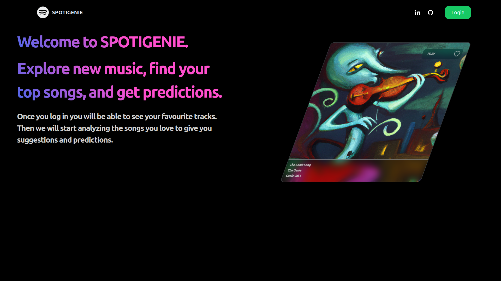
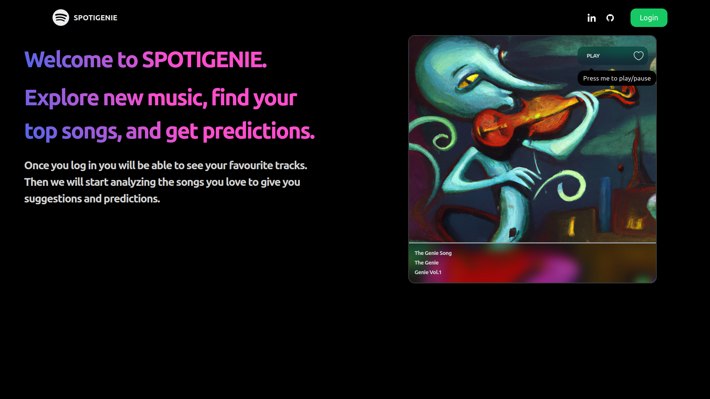

# Spotigenie

Spotigenie is a music recommendation web app made with NodeJS and ReactJS.

## Available Features

### Finding your most played songs at the moment.

### Giving recommendations based on your most played songs.

### Predicting whether you'll like a song based on your library.

### Responsive UI

### Other images

